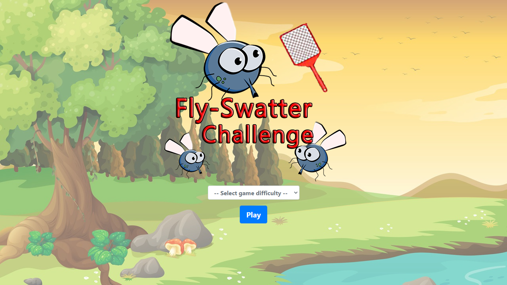

# Fly-Swatter Challenge Game

This project is a game coded in JavaScript, HTML, CSS and Bootstrap.

## Screenshot 

## Purpose of the Game

If the ***fly*** element is clicked before it's automatically removed (deleted from the screen) and there still is time remaining and life points remaining (filled hearts), the user continues to play. If the ***fly*** element is not clicked  before its automatic removal, the life points are affected (--1). The purpose of the game is that the user stays "alive" (clicking on every fly that appears on the screen) until the timer runs out.

## Technology Stack

+ JavaScript
+ HTML
+ CSS
+ Bootstrap
